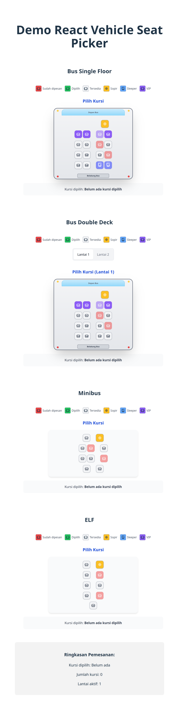

# React Vehicle Seat Picker

[](https://badge.fury.io/js/react-vehicle-seatpicker)
[](https://opensource.org/licenses/MIT)

*Read this in other languages: [English](README.en.md), [Bahasa Indonesia](README.id.md)*

<p align="center">
  
</p>

A flexible and customizable React component for vehicle seat selection (bus, minibus, van, etc.)

## Features

- Modern UI with smooth animations
- Multi-vehicle support (bus, minibus, van)
- Multi-floor support with floor selector
- Multiple seat types (Regular, VIP, Sleeper)
- Flexible layout and configuration
- Accessibility support
- Responsive design
- Full TypeScript support

## Installation

```bash
npm install react-vehicle-seatpicker
```

or

```bash
yarn add react-vehicle-seatpicker
```

## Basic Usage

```tsx
import React, { useState } from 'react';
import { SeatPickerComponent } from 'react-vehicle-seatpicker';

function App() {
  const [selectedSeats, setSelectedSeats] = useState<(string|number)[]>([]);
  const reservedSeats = ['1', '3', '7']; // Reserved seats

  return (
    <div>
      <SeatPickerComponent
        vehicleType="minibus"
        selectedSeats={selectedSeats}
        reservedSeats={reservedSeats}
        onSelect={setSelectedSeats}
        withDriver={true}
      />
    </div>
  );
}
```

## Props API

| Prop | Type | Default | Description |
|------|------|---------|-------------|
| `layout` | `Array<Array<Seat \| null>>` | `undefined` | Custom seat layout (optional) |
| `reservedSeats` | `(string\|number)[]` | `[]` | Array of reserved seat IDs |
| `selectedSeats` | `(string\|number)[]` | `[]` | Array of selected seat IDs |
| `onSelect` | `(seats: (string\|number)[]) => void` | `undefined` | Callback when seats are selected |
| `rowConfig` | `number[]` | auto | Number of seats per row configuration |
| `seatCount` | `number` | auto | Total number of seats |
| `withDriver` | `boolean` | `true` | Show driver seat |
| `vehicleType` | `VehicleType` | `"minibus"` | Vehicle type |
| `seatTypes` | `Record<string\|number, SeatType>` | `{}` | Seat type mapping per ID |
| `defaultSeatType` | `SeatType` | `"regular"` | Default seat type |
| `floorsConfig` | `Record<string, FloorConfig>` | `undefined` | Multi-floor configuration |
| `selectedFloor` | `string` | `"1"` | Selected floor |
| `onFloorChange` | `(floor: string) => void` | `undefined` | Floor change callback |

## Vehicle Types

### Minibus (Default)
```tsx
<SeatPickerComponent
  vehicleType="minibus"
  rowConfig={[2, 2, 2, 2]} // 2 seats per row
/>
```

### Bus
```tsx
<SeatPickerComponent
  vehicleType="bus"
  rowConfig={[4, 4, 4, 4, 4, 4, 4]} // 4 seats per row
/>
```

### Van
```tsx
<SeatPickerComponent
  vehicleType="elf"
  rowConfig={[1, 2, 2, 2, 1]} // Van layout
/>
```

## Seat Types

```tsx
const seatTypes = {
  '1': 'vip',
  '2': 'vip', 
  '15': 'sleeper',
  '16': 'sleeper'
};

<SeatPickerComponent
  seatTypes={seatTypes}
  defaultSeatType="regular"
/>
```

## Development

For library development:

```bash
# Install dependencies
npm install

# Build library
npm run build

# Watch mode for development
npm run dev

# Type checking
npm run type-check

# Linting
npm run lint
```

## Contributing

Contributions are welcome! Please:

1. Fork the repository
2. Create your feature branch (`git checkout -b feature/AmazingFeature`)
3. Commit your changes (`git commit -m 'Add some AmazingFeature'`)
4. Push to the branch (`git push origin feature/AmazingFeature`)
5. Create a Pull Request

## License

Distributed under the MIT License. See `LICENSE` for more information.

## Support

For questions or issues:

- [Report Bug](https://github.com/RahmatRafiq/react-vehicle-seatpicker/issues)
- [Request Feature](https://github.com/RahmatRafiq/react-vehicle-seatpicker/issues)
- Email: rahmatrafiq@example.com

---

Created by [RahmatRafiq](https://github.com/RahmatRafiq)