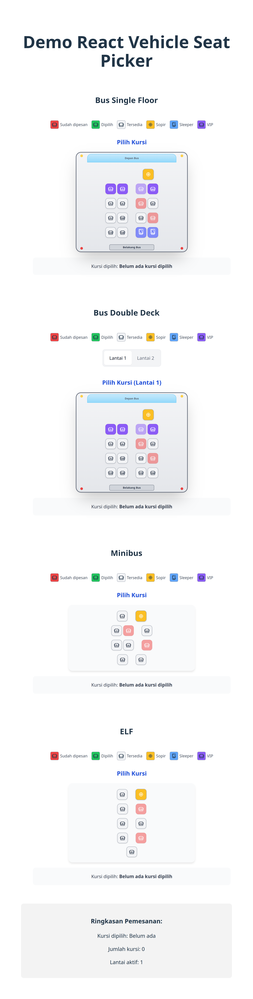

# React Vehicle Seat Picker

Flexible React component for vehicle seat selection (bus, minibus, elf) with multi-floor support and multiple seat types.

[](https://www.npmjs.com/package/react-vehicle-seatpicker)  
[](https://github.com/RahmatRafiq/react-vehicle-seatpicker/blob/main/LICENSE)

## Demo

Live demo and documentation: https://react-vehicle-seatpicker-demo.vercel.app/

## Preview

Below are example views of the component for different vehicle types.

  


## Features

- Supports multiple vehicle types (bus, minibus, elf)
- Customizable seat types (regular, VIP, sleeper, driver)
- Flexible layout configuration
- Multi-floor support
- TypeScript support
- Lightweight and performant

## Installation

```bash
npm install react-vehicle-seatpicker
# or
yarn add react-vehicle-seatpicker
# or
pnpm add react-vehicle-seatpicker
```

## Basic Usage

### 1. Simple Minibus

```jsx
import { SeatPicker } from 'react-vehicle-seatpicker';

function MinibusExample() {
  const handleSelect = (selectedSeats) => {
    console.log('Selected seats:', selectedSeats);
  };

  return (
    <SeatPicker
      vehicleType="minibus"
      rowConfig={[2, 2, 2, 2]}
      withDriver={true}
      onSelect={handleSelect}
      reservedSeats={['1', '2']}
    />
  );
}
```

### 2. Bus with Multiple Floors

```jsx
import { useState } from 'react';
import { SeatPicker } from 'react-vehicle-seatpicker';

function BusExample() {
  const [selectedFloor, setSelectedFloor] = useState('1');

  const floorsConfig = {
    '1': {
      row_config: [4, 4, 4, 4],
      seat_types: {
        '1': 'vip',
        '2': 'vip',
        '3': 'sleeper'
      },
      default_seat_type: 'regular'
    },
    '2': {
      row_config: [3, 3, 3],
      seat_types: {},
      default_seat_type: 'regular'
    }
  };

  return (
    <SeatPicker
      vehicleType="bus"
      floorsConfig={floorsConfig}
      selectedFloor={selectedFloor}
      onFloorChange={setSelectedFloor}
      onSelect={(seats) => console.log('Selected seats:', seats)}
      reservedSeats={['1', '5']}
    />
  );
}
```

### 3. Custom Seat Type Configuration

```jsx
import { SeatPicker } from 'react-vehicle-seatpicker';

function CustomSeatTypesExample() {
  return (
    <SeatPicker
      vehicleType="elf"
      rowConfig={[1, 2, 2, 2, 1]}
      seatTypes={{
        '1': 'vip',
        '2': 'sleeper',
        '3': 'regular'
      }}
      defaultSeatType="regular"
      onSelect={(seats) => console.log('Selected seats:', seats)}
    />
  );
}
```

## Props

| Prop | Type | Description |
|------|------|-------------|
| `vehicleType` | `"minibus" \| "bus" \| "elf"` | Vehicle type to use |
| `rowConfig` | `number[]` | Seats per row configuration |
| `withDriver` | `boolean` | Show driver seat (default: `true`) |
| `reservedSeats` | `(string\|number)[]` | Array of reserved seat IDs |
| `selectedSeats` | `(string\|number)[]` | Array of currently selected seat IDs |
| `onSelect` | `(seats: (string\|number)[]) => void` | Callback when seat(s) are selected/unselected |
| `seatTypes` | `Record<string\|number, SeatType>` | Seat type overrides by ID |
| `defaultSeatType` | `"regular" \| "vip" \| "sleeper"` | Default seat type |
| `floorsConfig` | `Record<string, FloorConfig>` | Multi-floor configuration for buses |
| `selectedFloor` | `string` | Currently active floor |
| `onFloorChange` | `(floor: string) => void` | Callback when floor changes |
| `legendConfig` | `LegendConfig` | Legend configuration (show/hide, items, labels) |
| `seatColors` | `SeatColors` | Color customization for seat types |

## Type Definitions

### Core Types

```typescript
type SeatType = "regular" | "driver" | "sleeper" | "vip" | string;
type VehicleType = "minibus" | "bus" | "elf" | string;

interface Seat {
  id: string | number;
  number: string;
  isReserved: boolean;
  isDriver?: boolean;
  type?: SeatType;
  seatRotation?: number;
}
```

### LegendConfig

```typescript
interface LegendConfig {
  show?: boolean;
  items?: ("reserved" | "selected" | "available" | "driver" | "sleeper" | "vip")[];
  labels?: {
    reserved?: string;
    selected?: string;
    available?: string;
    driver?: string;
    sleeper?: string;
    vip?: string;
  };
}
```

### SeatColors

```typescript
interface SeatColors {
  reserved?: string;
  selected?: string;
  available?: string;
  driver?: string;
  sleeper?: string;
  vip?: string;
}
```

## Seat Types

- `regular` — Standard seat
- `driver` — Driver seat (added automatically when `withDriver={true}`)
- `sleeper` — Reclining / sleeper seat
- `vip` — VIP / first-class seat

## Default Layouts

### Minibus
```ts
const defaultMinibusConfig = [2, 2, 2, 2];
```

### Bus
```ts
const defaultBusConfig = [4, 4, 4, 4, 4, 4, 4];
```

### Elf
```ts
const defaultElfConfig = [1, 2, 2, 2, 1];
```

## Custom Layout Examples

### Manual Layout

```jsx
const customLayout = [
  [null, null, null, null, null, { id: "D", number: "Driver", isReserved: true, isDriver: true }],
  [
    { id: 1, number: "1", isReserved: false },
    { id: 2, number: "2", isReserved: false },
    null,
    { id: 3, number: "3", isReserved: false },
    { id: 4, number: "4", isReserved: false }
  ]
];

<SeatPicker
  layout={customLayout}
  onSelect={(seats) => console.log('Selected seats:', seats)}
/>
```

### Multi-Floor Bus

```jsx
const busConfig = {
  '1': {
    row_config: [4, 4, 4],
    seat_types: {
      '1': 'vip',
      '2': 'sleeper'
    },
    default_seat_type: 'regular'
  },
  '2': {
    row_config: [3, 3, 3],
    seat_types: {},
    default_seat_type: 'regular'
  }
};

<SeatPicker
  vehicleType="bus"
  floorsConfig={busConfig}
  selectedFloor="1"
  onFloorChange={(floor) => console.log('Switched to floor:', floor)}
  onSelect={(seats) => console.log('Selected seats:', seats)}
/>
```

## Additional Features

### Customize Legend and Colors

#### Custom Legend
```jsx
<SeatPicker
  legendConfig={{
    show: true,
    items: ["reserved", "selected", "available", "driver"],
    labels: {
      reserved: "Reserved",
      selected: "Selected",
      available: "Available",
      driver: "Driver",
      sleeper: "Sleeper",
      vip: "First Class"
    }
  }}
/>
```

#### Custom Colors
```jsx
<SeatPicker
  seatColors={{
    reserved: "#E0E0E0",
    selected: "#4CAF50",
    available: "#FFFFFF",
    driver: "#2196F3",
    sleeper: "#9C27B0",
    vip: "#FFC107"
  }}
/>
```

### Vehicle Frame

- Bus: full bus frame with front/rear indicators
- Minibus/Elf: simplified frame

### Seat Rotation

Add a `seatRotation` property (in degrees) to rotate seats:

```jsx
const layout = [
  [
    { 
      id: 1, 
      number: "1", 
      isReserved: false,
      seatRotation: 90
    }
  ]
];
```

## Contributing

Contributions are welcome. Please open a Pull Request for improvements or new features.

## License

This project is licensed under the MIT License. See [LICENSE](LICENSE) for details.

## Author

RahmatRafiq

## Support

If you have questions or need help, please open an issue in the [GitHub repository](https://github.com/RahmatRafiq/react-vehicle-seatpicker/issues).
